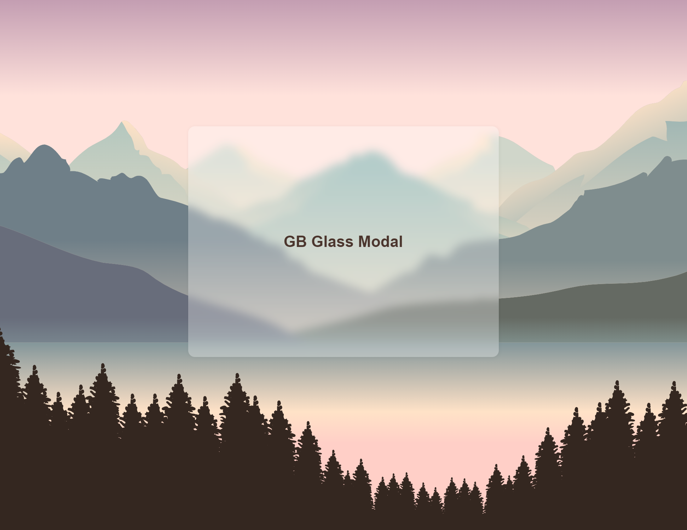

CSS HTML simple Glass Modal 

## Community codders, please commit

Feel free to add extra functions or improvements, This helps me to more familiarise with source control and open source project managing

## Running instructions

* copy project to your directory ( git clone https://github.com/ibnzUK/BG-Glass-modal )
* run index.html
